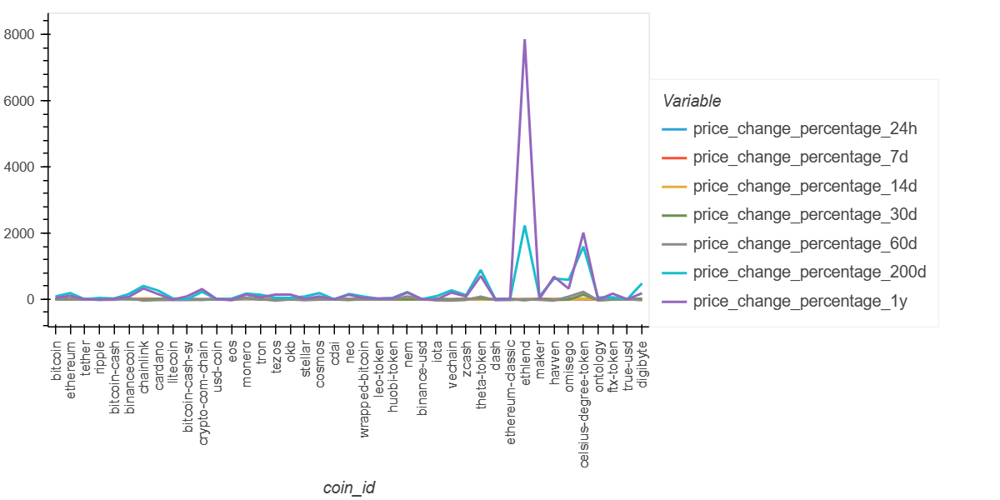
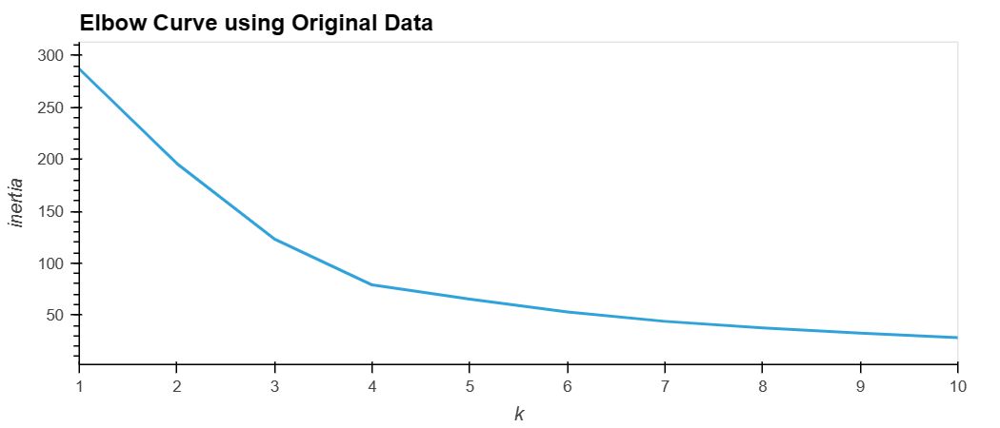
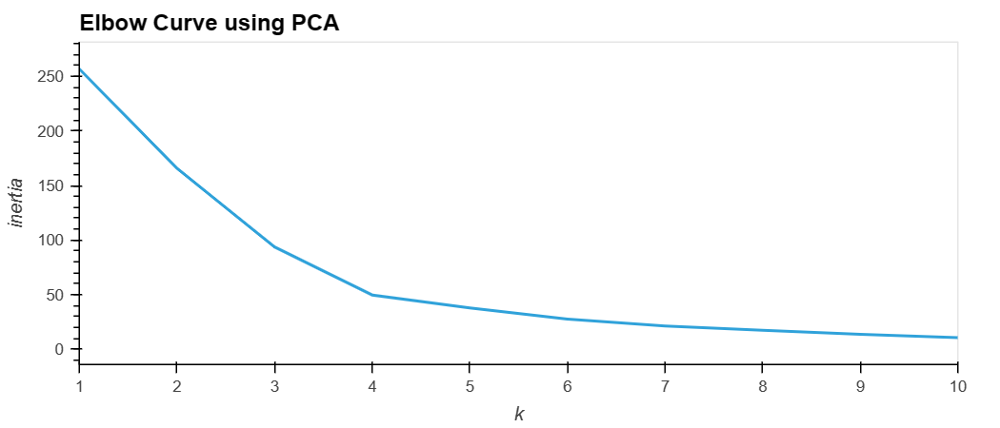
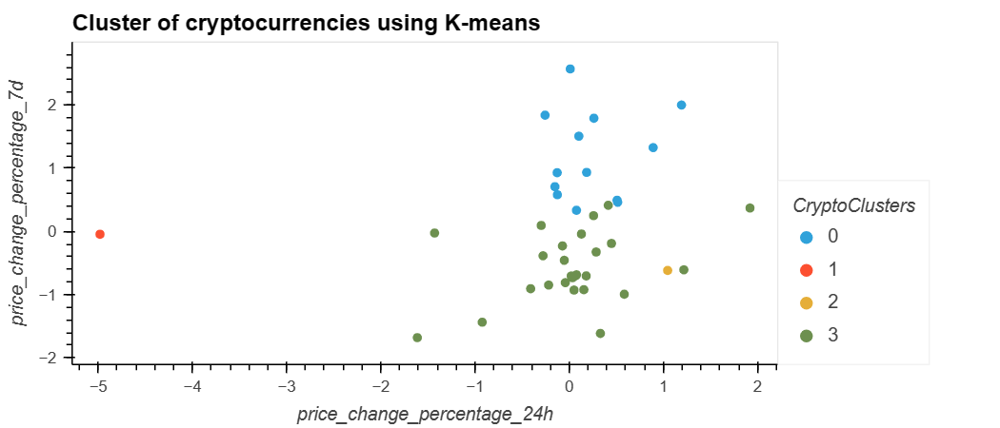
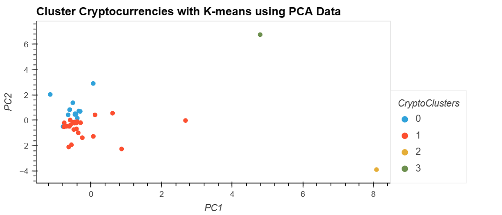

# crypto_clustering
## Challenge: Crypto Clustering

Cluster the performance of the cryptocurrences and plot the results using csv file provided in the Resources folder

**Plot of the data in the Dataframe**

## Analysis of original data provided using K-means

**Elbow curve using original data**

**Question:** What is the best value for k?

**Answer:** In my opinion, it appears from the elbow curve that the best value for k is 4.

## Optimizing clusters using PCA

**Elbow curve using PCA data**

* **Question:** What is the total explained variance of the three principal components?

* **Answer:** The total explained variance of the three principal components is approximately 89.5%

* **Question:** What is the best value for k when using the PCA data?

* **Answer:** Using the PCA data, the best value for k, in my opinion, is 4.

* **Question:** Does it differ from the best k value found using the original data?

* **Answer:** The best k value is the same for both, original data and PCA data.

## Comparing Clusters using original data and PCA data

**Question:** After visually analyzing the cluster analysis results, what is the impact of using fewer features to cluster the data using K-Means?

**Answer:** It appears from both the cluster analyses that the impact of using fewer features to cluster the data using K-means is that the data is grouped in customer segments.